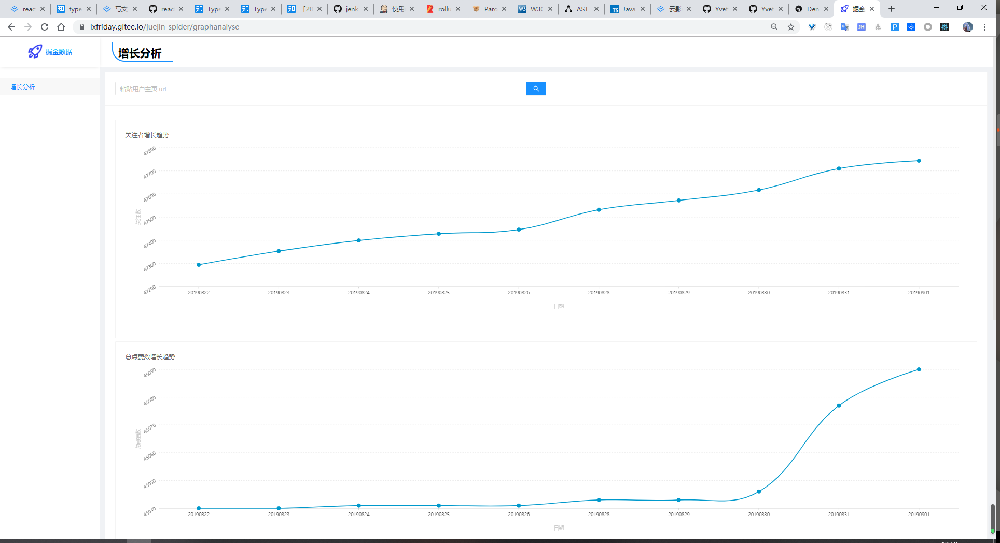
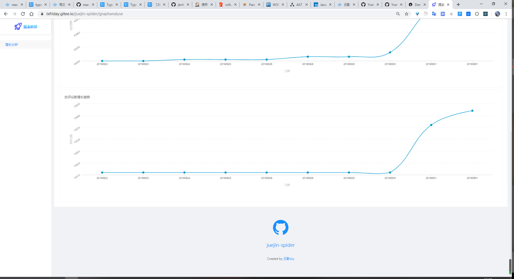

# juejin-spider

[排名历史变化查看](https://lxfriday.gitee.io/juejin-spider)

在输入框输入用户主页的 url 搜索。例如我的主页是 [https://juejin.im/user/57a0c28979bc440054958498](https://juejin.im/user/57a0c28979bc440054958498)




文章教你如何做掘金站内数据抓取，数据解析，最后形成排序后的排名。

**数据来源于[掘金](https://juejin.im)，如有侵权，请联系 [liu3248184446@outlook.com](mailto://liu3248184446@outlook.com) 删除**

---

**项目起因是我突然想看看掘金站内有哪些优质作者，为了不错过每一个大佬，我选择直接抓取站内所有的文章信息找到作者并进行排名。各位关注 + 文章阅读 一条龙走起！**

[项目地址 juejin-spider](https://github.com/lxfriday/juejin-spider) 欢迎 star issue

掘金 spider 和数据分析，主要关注了下面几个排行和统计，排行点击直接查看

- [掘金用户排名（前 5000，按关注者）](./src/assets/calcUserRank/%E7%94%A8%E6%88%B7followerRank.md)
- [掘金用户排名（前 5000，按用户点赞总量）](./src/assets/calcUserDianzanRank/%E7%94%A8%E6%88%B7%E7%82%B9%E8%B5%9Erank.md)
- [掘金站内标签总数](./src/assets/tagList/tagList.json)
- [掘金站内标签下文章](./src/assets/articleData)
- [文章评论量排行](./src/assets/calcCommentRank/%E8%AF%84%E8%AE%BA%E9%87%8Frank.md)
- [点赞量排行](./src/assets/calcDianzanRank/%E7%82%B9%E8%B5%9Erank.md)
- [浏览量排行](./src/assets/calcViewRank/%E6%B5%8F%E8%A7%88%E9%87%8Frank.md)

**先上掘金前 50 排名，关注一波？？？？** [前 5000 排名看这里](https://github.com/lxfriday/juejin-spider/blob/master/src/assets/calcUserRank/%E7%94%A8%E6%88%B7followerRank.md)

🎉 等级，👦 关注数，🏠 公司

- (1)[🎉 4][👦 67909] [🏠 掘金][阴明](https://juejin.im/user/551d677ee4b0cd5b623f49cb)
- (2)[🎉 5][👦 47061] [🏠 稀土][稀土君](https://juejin.im/user/551d6923e4b0cd5b623f54da)
- (3)[🎉 5][👦 45676] [🏠 Alibaba][hollischuang](https://juejin.im/user/56d79d3f128fe100513b924a)
- (4)[🎉 5][👦 44229] [🏠 ][腾讯云加社区](https://juejin.im/user/58afa29aac502e0069c5d756)
- (5)[🎉 3][👦 37565] [🏠 前端外刊评论网][前端外刊评论](https://juejin.im/user/5656fe2260b2febec4b52f46)
- (6)[🎉 0][👦 37062] [🏠 SN][丁一](https://juejin.im/user/5699faaf60b219d101745b7b)
- (7)[🎉 3][👦 34825] [🏠 腾讯 alloyteam -> 腾讯云 -> Shopee][李chengxi](https://juejin.im/user/55fbd5e360b249ad605fb5ea)
- (8)[🎉 3][👦 34588] [🏠 ][liutao](https://juejin.im/user/555426a7e4b076f1c3243993)
- (9)[🎉 3][👦 33436] [🏠 易快报][水墨寒](https://juejin.im/user/55edc49b60b294604dbc746e)
- (10)[🎉 1][👦 30516] [🏠 前掘金][next](https://juejin.im/user/55f4419360b28e983c150d0e)
- (11)[🎉 4][👦 28101] [🏠 公众号【远洋号】][超人汪小建](https://juejin.im/user/57c3970f79bc440063e58518)
- (12)[🎉 4][👦 27221] [🏠 ][stormzhangv](https://juejin.im/user/55fe1c23ddb263b5605b2c03)
- (13)[🎉 5][👦 25833] [🏠 ][java3y](https://juejin.im/user/5a7005b46fb9a01c995117a7)
- (14)[🎉 2][👦 25707] [🏠 吆喝科技][吆喝科技_zoran](https://juejin.im/user/57ea1966128fe100571df74e)
- (15)[🎉 5][👦 25237] [🏠 美团][美团技术团队](https://juejin.im/user/5abdf16f6fb9a028d1413539)
- (16)[🎉 0][👦 23913] [🏠 ][刘欣](https://juejin.im/user/570a0ff3c4c9710051b060b2)
- (17)[🎉 6][👦 23829] [🏠 宋小菜][yck](https://juejin.im/user/574f8d8d2e958a005fd4edac)
- (18)[🎉 5][👦 22345] [🏠 公众号『crossoverJie』][crossoverjie](https://juejin.im/user/576d4aaf7db2a20054ea4544)
- (19)[🎉 6][👦 21367] [🏠 ][技术胖](https://juejin.im/user/5875dfc7a22b9d0058a96d06)
- (20)[🎉 5][👦 21170] [🏠 ][石杉的架构笔记](https://juejin.im/user/5be0588ae51d452b0255727d)
- (21)[🎉 3][👦 21100] [🏠 阿里巴巴集团][闲鱼技术](https://juejin.im/user/5ac2db47f265da2393774122)
- (22)[🎉 1][👦 20815] [🏠 滴滴][孙福生](https://juejin.im/user/55f0f60b60b22f0f9c8d0afb)
- (23)[🎉 5][👦 20785] [🏠 前网易，现哈啰][木易杨说](https://juejin.im/user/56dea4aa7664bf00559f002d)
- (24)[🎉 2][👦 20642] [🏠 弋云科技][alecc](https://juejin.im/user/565fe3ab60b2d140d3182258)
- (25)[🎉 0][👦 20562] [🏠 滴滴出行][five_years_struggle](https://juejin.im/user/56d07072128fe10053f07d47)
- (26)[🎉 5][👦 20196] [🏠 ThoughtWorks 准入职][snailclimb](https://juejin.im/user/59fbb2daf265da4319559f3a)
- (27)[🎉 2][👦 20065] [🏠 ofo][猴子搬来的救兵](https://juejin.im/user/56ac70aa71cfe4005c0453ad)
- (28)[🎉 3][👦 20058] [🏠 HUAWEI][雨神姥爷](https://juejin.im/user/559603dce4b001ca17215568)
- (29)[🎉 2][👦 19307] [🏠 金融科技][taotao.li](https://juejin.im/user/572d7a3d71cfe400579ec7b0)
- (30)[🎉 4][👦 19068] [🏠 公众号【码洞】][老錢](https://juejin.im/user/5a9c4a13f265da23826d733a)
- (31)[🎉 2][👦 18847] [🏠 ][凤尾](https://juejin.im/user/55f7b95d60b27db44c106e10)
- (32)[🎉 5][👦 18465] [🏠 ][冴羽](https://juejin.im/user/58e4b9b261ff4b006b3227f4)
- (33)[🎉 5][👦 18390] [🏠 腾讯 微信][carson_ho](https://juejin.im/user/58d4d9781b69e6006ba65edc)
- (34)[🎉 2][👦 18318] [🏠 zhisheng][zhisheng](https://juejin.im/user/57510b82128fe10056ca70fc)
- (35)[🎉 0][👦 17887] [🏠 自由职业][it程序狮](https://juejin.im/user/56f3db6d1ea49300558b75f4)
- (36)[🎉 3][👦 17741] [🏠 Goertek][泱泱](https://juejin.im/user/58216407da2f60005d10b5f1)
- (37)[🎉 4][👦 17633] [🏠 纯源码解析，目前源码解析 500+篇][芋道源码_以德服人_不服就干](https://juejin.im/user/5904c637b123db3ee479d923)
- (38)[🎉 3][👦 17588] [🏠 胖橘网络][kyxu](https://juejin.im/user/55f939de60b232fc2a9ab37f)
- (39)[🎉 5][👦 17535] [🏠 Fundebug][fundebug](https://juejin.im/user/587d9f69b123db4d5e7ed9e3)
- (40)[🎉 0][👦 16984] [🏠 腾讯][flike](https://juejin.im/user/561f410660b2fe71110c25d6)
- (41)[🎉 3][👦 16962] [🏠 百度][胡子大哈](https://juejin.im/user/5882f8cf128fe1006c2f75c2)
- (42)[🎉 4][👦 16827] [🏠 ][老司机ios周报](https://juejin.im/user/5a52075e6fb9a01c9d31b107)
- (43)[🎉 4][👦 16364] [🏠 ][机器之心](https://juejin.im/user/59a67115f265da247f1c73b2)
- (44)[🎉 1][👦 15699] [🏠 AXE][果只](https://juejin.im/user/5719006f71cfe4005750a0c4)
- (45)[🎉 3][👦 15466] [🏠 ][mockplus](https://juejin.im/user/595a65426fb9a06bc7494ae0)
- (46)[🎉 5][👦 15448] [🏠 腾讯科技(深圳)有限公司][腾讯ivweb团队](https://juejin.im/user/5a9f77666fb9a028c14a01eb)
- (47)[🎉 6][👦 15421] [🏠 上海][obkoro1](https://juejin.im/user/58714f0eb123db4a2eb95372)
- (48)[🎉 5][👦 15362] [🏠 ELEME][sunshine小小倩](https://juejin.im/user/584d7a3e2f301e00572fb7fc)
- (49)[🎉 2][👦 15164] [🏠 ucashin.com][mrmuscles](https://juejin.im/user/5585a8fde4b06b8a729c1d5d)
- (50)[🎉 3][👦 15077] [🏠 ][已禁用](https://juejin.im/user/59a7a5a96fb9a02487554b86)

## 脚本

###

### 全站标签抓取

获取掘金站内所有标签信息

```bash
npm run tagList
```

会把标签信息写入到 `src/assets/tagList/tagList.json`，每个标签包含下面的信息，主要是 `title` 和 `id`

```js
{
  "id": "5597a063e4b08a686ce57030",
  "title": "后端",
  "createdAt": "2015-07-04T00:59:16Z",
  "updatedAt": "2017-06-18T23:34:00Z",
  "color": "#C679FF",
  "icon": "https://lc-gold-cdn.xitu.io/d83da9d012ddb7ae85f4.png",
  "background": "",
  "showOnNav": true,
  "relationTagId": "",
  "alias": "backend houduan",
  "isCategory": true,
  "entryCount": 19840,
  "subscribersCount": 295562,
  "isSubscribe": false
},
```

### 全站文章抓取

将会采集全站所有标签下面的所有文章，采集过程会因为网速和机器性能表现出差异，请各位耐心等待采集完成

这一步采集的数据非常重要，是后面所有分析的基础

采集到的文件会存放在 `src/assets/articleData` 下面，包含有很多 json 文件，每个文件包含这个标签下的所有专栏文章元信息

```bash
npm run allTagData
```

数组中每个对象

```js
{
  "collectionCount": 5, // 点赞数
  "userRankIndex": 5.4006856695164,
  "buildTime": 1565582852.8327,
  "commentsCount": 2, // 评论数
  "gfw": false,
  "objectId": "5d40d29d518825221b4cbb40",
  "checkStatus": true,
  "isEvent": false,
  "entryView": "",
  "subscribersCount": 0, // 无用
  "ngxCachedTime": 1565627197,
  "verifyStatus": true,
  "tags": [
    {
      "ngxCachedTime": 1565627193,
      "ngxCached": true,
      "title": "React.js",
      "id": "555e99ffe4b00c57d99556aa"
    }
  ],
  "updatedAt": "2019-08-12T04:07:32.818Z",
  "rankIndex": 0.005346156248974,
  "hot": false,
  "autoPass": false,
  "originalUrl": "https://juejin.im/post/5d3ef3646fb9a06b1b1999fd", // 文章的 url
  "verifyCreatedAt": "2019-07-31T01:36:14.238Z",
  "createdAt": "2019-07-31T01:36:14.238Z",
  "user": {
    "community": {
      "weibo": { "uid": "5345591282", "nickname": "岁月痕迹A88" },
      "wechat": {
        "avatarLarge": "http://thirdwx.qlogo.cn/mmopen/vi_32/cabLXAUXiavVhiaDh2050AOOEToUvnZTWsSNqqKZC4hzPzHABC7fxwv6VxwebIxfKdaRkYDZoic8UXfonLDyiafuiaw/132"
      },
      "github": {
        "username": "lxfriday",
        "avatarLarge": "https://avatars0.githubusercontent.com/u/20264467?v=4",
        "uid": "20264467"
      }
    },
    "collectedEntriesCount": 154, // 用户给别人点的点赞数
    "company": "xxx", // 公司
    "followersCount": 35, // 被关注数
    "followeesCount": 70, // 关注数
    "role": "guest", // 用户角色
    "postedPostsCount": 19, // 发布的专栏数
    "level": 2, // 用户等级
    "isAuthor": false,
    "postedEntriesCount": 2, // 分享数？
    "totalCommentsCount": 16, // 总评论数
    "ngxCachedTime": 1565627197,
    "viewedEntriesCount": 1347, // 查看的文章数
    "jobTitle": "前端", // 工作：前端
    "subscribedTagsCount": 166, // 关注的标签数
    "totalCollectionsCount": 120, // 总点赞数
    "username": "云影sky", // 用户名
    "avatarLarge": "https://user-gold-cdn.xitu.io/2019/7/14/16bf1155693d96c2?w=570&h=488&f=png&s=312610",
    "objectId": "57a0c28979bc440054958498" // 用户 id
  },
  "author": "",
  "screenshot": "https://user-gold-cdn.xitu.io/2019/7/29/16c3e3d979a96831?w=1097&h=573&f=png&s=58239",
  "original": true,
  "hotIndex": 21.2095,
  "content": "给 PureComponent 重新指向构造函数之后，_assign 复制对象属性时， Component 构造函数不会覆盖 PureComponent 构造函数，看下面的例子就明白了。 把 PureComponent 变成 Component，userInfo 可正常变化。",
  "title": "React 源码系列-Component、PureComponent、function Component 分析",
  "lastCommentTime": "2019-08-03T16:53:20.577Z",
  "type": "post",
  "english": false,
  "category": {
    "ngxCached": true,
    "title": "frontend",
    "id": "5562b415e4b00c57d9b94ac8",
    "name": "前端",
    "ngxCachedTime": 1565627098
  },
  "viewsCount": 267, // 浏览量
  "summaryInfo": "经过 处理之后，三个组件的区别就是 type 不一样了 和 看不懂可以看下这篇文章 https://www.zhihu.com/question/34183746 js 中 和 的区别和关系 函数的 属性对象上的 是不可枚举的，所以下面两句 给 PureComponent 重新指向构造函数之后， ...",
  "isCollected": false
}
```

### 在标签下发表过专栏的用户计算

在标签下发表过专栏的用户计算

```bash
npm run userData
```

脚本执行完成会产生多个 `${number}-userData.json` 文件

- `src/assets/userData/${number}-userData.json` 多个 json 文件是所有用户的开放信息，用来计算日变化量

### 关注量排行

获取站内浏览量

```bash
npm run follower
```

脚本执行完成会产生两个文件

- `src/assets/calcUserRank/用户followerRank.json` 是排行后的元信息
- `src/assets/calcUserRank/用户followerRank.md` 按排名编排的 md 文档

### 点赞排行

获取站内点赞排行

```bash
npm run dianzan
```

脚本执行完成会产生两个文件

- `src/assets/calcDianzanRank/点赞rank.json` 是排行后的元信息
- `src/assets/calcDianzanRank/点赞rank.md` 按排名编排的 md 文档

例子

- (1)[👍 5409][📌 程序员] [前端 100 问：能搞懂 80% 的请把简历给我](https://juejin.im/post/5d23e750f265da1b855c7bbe)
- (2)[👍 4416][📌 vue.js] [2018 前端面试总结，看完弄懂，工资少说加 3K | 掘金技术征文](https://juejin.im/post/5b94d8965188255c5a0cdc02)

### 全站文章浏览量排行

获取站内浏览量

```bash
npm run view
```

脚本执行完成会产生两个文件

- `src/assets/calcViewRank/浏览量rank.json.json` 是排行后的元信息
- `src/assets/calcViewRank/浏览量rank.json.md` 按排名编排的 md 文档

### 全站文章评论量排行

获取站内浏览量

```bash
npm run comment
```

脚本执行完成会产生两个文件

- `src/assets/calcCommentRank/calcCommentRank.json` 是排行后的元信息
- `src/assets/calcCommentRank/calcCommentRank.md` 按排名编排的 md 文档

### 自动分析 uidfile 算法处理后的数据分布状况

自动分析 `uidfile` 算法处理后的数据分布状况

```bash
npm run uidfile
```

脚本执行完成会产生一个文件

- `src/sitedata/uidfile/uidfile.md` 分布状况文档

### 自动生成当日 website 网站图形数据

自动生成当日 website 网站图形数据

```bash
npm run sitedata
```

脚本执行完成会产生 50+个文件

- `website/public/data/${yeardate}/${0-49}.json` 当日的统计数据，50 个文件，经过 uidfile 算法处理形成的文件名
- `website/public/data/${yeardate}/userCount.txt` 处理到的总用户数

`${0-49}.json` 文件结构

```js
{
  "5a66dff2f265da3e4f0a4f1b":[4966,4430,140],  // ...
}
// 关注者，总点赞量，总评论量
// [user.objectId]: [followersCount, totalCollectionsCount, totalCommentsCount]
```

## 技术解析

- `async` 并发控制
- `chalk` 多彩命令行
- `request` 发送 http 请求
- `request-promise` 把 request promise 化，方便使用 async

项目辅助工具 dev assistant

- `commitlint` 规范 commit message
- `eslint` 大家都懂
- `prettier` 自动格式化代码
- `husky` 提供 git 钩子
- `lint-staged` 只对当前变动的文件执行格式化和 eslint 校验
- `jest` 测试排序算法正确性

### 前 1000、前 5000 在 20w 条数据中是如何计算的

**构建小顶堆，不断往堆中添加数据，比堆顶小的直接抛弃，比堆顶大的，替换成堆顶并对二叉树进行调整，维持小顶堆。遍历所有数据之后 小顶堆就是我们要的所有最大值排行，再对这个数组排序依次就可以获取排名了！！！**

- 排序算法 [sortPrev](https://github.com/lxfriday/juejin-spider/blob/master/src/utils/sortPrev.js)
- 使用 [计算全站文章浏览量排行](https://github.com/lxfriday/juejin-spider/blob/master/src/calcViewRank.js)

```js
// 最小值上浮
function heapify(arr, len, i, compareVal) {
  let min = i
  const l = 2 * i + 1
  const r = 2 * i + 2

  if (l < len && compareVal(arr[l]) < compareVal(arr[min])) min = l
  if (r < len && compareVal(arr[r]) < compareVal(arr[min])) min = r

  if (min !== i) {
    swap(arr, i, min)

    heapify(arr, len, min, compareVal)
  }
}

/**
 * 对 target 建堆
 * @param {array} target 堆数组
 * @param {*} compareVal 从 dataUnit 对象获取比对值
 */
function createHeap(target, compareVal = v => v) {
  for (let i = Math.floor((target.length - 1) / 2); i >= 0; i--) {
    heapify(target, target.length, i, compareVal)
  }
}

function findMaxPrev(dataUnit, target, compareVal = v => v) {
  if (compareVal(dataUnit) > compareVal(target[0])) {
    target[0] = dataUnit
    heapify(target, target.length, 0, compareVal)
  }
}
```

## 排行

### 浏览量排行

👀 浏览量，📌 标签

- (1)[👀 817784][📌 android] [蜻蜓 FM 涉嫌诈骗投资人和广告主源代码剖析](https://juejin.im/entry/5640a72a00b0023ca8f567a7/)
- (2)[👀 471926][📌 vue.js] [手摸手，带你用 vue 撸后台 系列一（基础篇）](https://juejin.im/post/59097cd7a22b9d0065fb61d2)
- (3)[👀 336824][📌 vue.js] [ 手摸手，带你用 vue 撸后台 系列二(登录权限篇)](https://juejin.im/post/591aa14f570c35006961acac)
- (4)[👀 261110][📌 面试] [中高级前端大厂面试秘籍，为你保驾护航金三银四，直通大厂(上)](https://juejin.im/post/5c64d15d6fb9a049d37f9c20)
- (5)[👀 173030][📌 程序员] [前端 100 问：能搞懂 80% 的请把简历给我](https://juejin.im/post/5d23e750f265da1b855c7bbe)
- (6)[👀 147633][📌 go] [Gos: GO MODULE 解决方案 💪](https://juejin.im/post/5ce3f6ede51d455cd73b9fef)
- (7)[👀 143114][📌 javascript] [首个微信小程序开发教程！](https://juejin.im/entry/57e34d6bd2030900691e9ad7)
- (8)[👀 140469][📌 vue.js] [ 手摸手，带你用 vue 撸后台 系列三(实战篇)](https://juejin.im/post/593121aa0ce4630057f70d35)
- (9)[👀 139499][📌 vue.js] [2018 前端面试总结，看完弄懂，工资少说加 3K | 掘金技术征文](https://juejin.im/post/5b94d8965188255c5a0cdc02)
- (10)[👀 137958][📌 vue.js] [手摸手，带你用 vue 撸后台 系列四(vueAdmin 一个极简的后台基础模板)](https://juejin.im/post/595b4d776fb9a06bbe7dba56)
- (11)[👀 120472][📌 javascript] [一个合格的中级前端工程师必须要掌握的 28 个 JavaScript 技巧](https://juejin.im/post/5cef46226fb9a07eaf2b7516)
- (12)[👀 116779][📌 程序员] [疑因内部宫斗被离职，中兴 70 后程序员从公司坠楼 ​​​​](https://juejin.im/post/5a32942ef265da43104868fe)
- (13)[👀 105344][📌 javascript] [这一次，彻底弄懂 JavaScript 执行机制](https://juejin.im/post/59e85eebf265da430d571f89)
- (14)[👀 100848][📌 github] [2018 Java 后端工程师的书单推荐](https://juejin.im/post/59c2f3e16fb9a00a600f6a5c)
- (15)[👀 98813][📌 javascript] [一名【合格】前端工程师的自检清单](https://juejin.im/post/5cc1da82f265da036023b628)
- (16)[👀 95634][📌 javascript] [知道这 20 个正则表达式，能让你少写 1,000 行代码](http://www.jianshu.com/p/e7bb97218946)
- (17)[👀 89452][📌 前端] [ES6、ES7、ES8、ES9、ES10 新特性一览](https://juejin.im/post/5ca2e1935188254416288eb2)
- (18)[👀 88587][📌 android] [RxJava2 只看这一篇文章就够了](https://juejin.im/post/5b17560e6fb9a01e2862246f)
- (19)[👀 86096][📌 vue.js] [手摸手，带你优雅的使用 icon](https://juejin.im/post/59bb864b5188257e7a427c09)
- (20)[👀 84639][📌 开源] [中国首位 00 后 CEO 公然抄袭、复制我的开源作品](https://juejin.im/post/59ad758a518825243d1f28cb)

### 点赞量排行

👍 点赞数，📌 标签

- (1)[👍 5488][📌 程序员] [前端 100 问：能搞懂 80% 的请把简历给我](https://juejin.im/post/5d23e750f265da1b855c7bbe)
- (2)[👍 4431][📌 vue.js] [2018 前端面试总结，看完弄懂，工资少说加 3K | 掘金技术征文](https://juejin.im/post/5b94d8965188255c5a0cdc02)
- (3)[👍 4368][📌 javascript] [这一次，彻底弄懂 JavaScript 执行机制](https://juejin.im/post/59e85eebf265da430d571f89)
- (4)[👍 4216][📌 面试] [一个合格(优秀)的前端都应该阅读这些文章](https://juejin.im/post/5d387f696fb9a07eeb13ea60)
- (5)[👍 4183][📌 面试] [中高级前端大厂面试秘籍，为你保驾护航金三银四，直通大厂(上)](https://juejin.im/post/5c64d15d6fb9a049d37f9c20)
- (6)[👍 3890][📌 javascript] [一名【合格】前端工程师的自检清单](https://juejin.im/post/5cc1da82f265da036023b628)
- (7)[👍 3807][📌 vue.js] [近两万字小程序攻略发布了](https://juejin.im/post/5b8fd1416fb9a05cf3710690)
- (8)[👍 3701][📌 javascript] [一个合格的中级前端工程师必须要掌握的 28 个 JavaScript 技巧](https://juejin.im/post/5cef46226fb9a07eaf2b7516)
- (9)[👍 3664][📌 react.js] [技术胖 155 集前端视频教程-全部免费观看](https://juejin.im/post/5a5bc8c36fb9a01ca26774eb)
- (10)[👍 3551][📌 android] [Kotlin 资源大全 - 学 Kotlin 看这一篇教程就够了](https://juejin.im/post/591dd9f544d904006c9fbb96)
- (11)[👍 3342][📌 html] [前端常用插件、工具类库汇总，不要重复造轮子啦！！！](https://juejin.im/post/5ba7d5dd5188255c6140cc9d)
- (12)[👍 3338][📌 vue.js] [新年献礼 技术胖 262 集前端免费视频 让您走的更容易些](https://juejin.im/post/5c11bf145188252704368b98)
- (13)[👍 3205][📌 javascript] [知道这 20 个正则表达式，能让你少写 1,000 行代码](http://www.jianshu.com/p/e7bb97218946)
- (14)[👍 3202][📌 前端] [总结了 17 年初到 18 年初百场前端面试的面试经验(含答案)](https://juejin.im/post/5b44a485e51d4519945fb6b7)
- (15)[👍 2958][📌 前端框架] [大型项目前端架构浅谈（8000 字原创）](https://juejin.im/post/5cea1f705188250640005472)
- (16)[👍 2932][📌 react.js] [2018 春招前端面试: 闯关记(精排精校) | 掘金技术征文](https://juejin.im/post/5a998991f265da237f1dbdf9)
- (17)[👍 2902][📌 vue.js] [手摸手，带你用 vue 撸后台 系列一（基础篇）](https://juejin.im/post/59097cd7a22b9d0065fb61d2)
- (18)[👍 2879][📌 javascript] [个人分享--web 前端学习资源分享](https://juejin.im/post/5a0c1956f265da430a501f51)
- (19)[👍 2871][📌 css] [你未必知道的 49 个 CSS 知识点](https://juejin.im/post/5d3eca78e51d4561cb5dde12)
- (20)[👍 2846][📌 javascript] [JavaScript 深入系列 15 篇正式完结！](https://juejin.im/post/59278e312f301e006c2e1510)
- (21)[👍 2743][📌 react.js] [2018 上半年掘金微信群日报优质文章合集：前端篇](https://juejin.im/post/5b3adfe2e51d4555b17e85df)
- (22)[👍 2643][📌 后端] [后端架构师技术图谱](https://github.com/xingshaocheng/architect-awesome/blob/master/README.md#数据结构)
- (23)[👍 2538][📌 vue.js] [Vue 项目里戳中你痛点的问题及解决办法（更新）](https://juejin.im/post/5b174de8f265da6e410e0b4e)
- (24)[👍 2520][📌 javascript] [webpack 详解](https://juejin.im/post/5aa3d2056fb9a028c36868aa)
- (25)[👍 2481][📌 android] [花了 4 个月整理了 50 篇 Android 干货文章](https://juejin.im/post/5940e0f6128fe1006a0d6cd9)
- (26)[👍 2468][📌 vue.js] [vue 中 Axios 的封装和 API 接口的管理](https://juejin.im/post/5b55c118f265da0f6f1aa354)
- (27)[👍 2439][📌 css] [干货!各种常见布局实现+知名网站实例分析](https://juejin.im/post/5aa252ac518825558001d5de)
- (28)[👍 2427][📌 javascript] [JavaScript 专题系列 20 篇正式完结！](https://juejin.im/post/59eff1fb6fb9a044ff30a942)
- (29)[👍 2371][📌 react.js] [年终回顾，为你汇总一份「前端技术清单」](https://juejin.im/post/5bdfb387e51d452c8e0aa902)
- (30)[👍 2340][📌 css] [关于移动端适配，你必须要知道的](https://juejin.im/post/5cddf289f265da038f77696c)
- (31)[👍 2301][📌 html] [前端开发者指南（2017）](https://juejin.im/post/592faca42f301e006bc791e0)
- (32)[👍 2279][📌 前端] [总有你要的编程书单（GitHub）](http://blog.didiaoyuan.com/2017/04/18/%E6%80%BB%E6%9C%89%E4%BD%A0%E8%A6%81%E7%9A%84%E7%BC%96%E7%A8%8B%E4%B9%A6%E5%8D%95%EF%BC%88GitHub-%EF%BC%89)
- (33)[👍 2247][📌 程序员] [一个前端的 2018 总结，2019 展望 | 掘金年度征文](https://juejin.im/post/5c3c031ce51d45518c67d45e)
- (34)[👍 2243][📌 react.js] [前端面试考点多？看这些文章就够了（2019 年 6 月更新版）](https://juejin.im/post/5aae076d6fb9a028cc6100a9)
- (35)[👍 2239][📌 react.js] [四月前端知识集锦（每月不可错过的文章集锦）](https://juejin.im/post/5ae95f17f265da0b93481dec)
- (36)[👍 2219][📌 javascript] [前端进阶必备，github 优质资源整理分享！](https://juejin.im/post/5d3edad9f265da03a652f133)
- (37)[👍 2211][📌 html] [前端必会的 Nginx 入门视频教程(共 11 集)](https://juejin.im/post/5bd7a6046fb9a05d2c43f8c7)
- (38)[👍 2207][📌 android] [Android 面试知识库](https://github.com/GeniusVJR/LearningNotes)
- (39)[👍 2191][📌 javascript] [「中高级前端面试」JavaScript 手写代码无敌秘籍](https://juejin.im/post/5c9c3989e51d454e3a3902b6)
- (40)[👍 2189][📌 javascript] [JS 正则表达式完整教程（略长）](https://juejin.im/post/5965943ff265da6c30653879)
- (41)[👍 2178][📌 前端] [ES6、ES7、ES8、ES9、ES10 新特性一览](https://juejin.im/post/5ca2e1935188254416288eb2)
- (42)[👍 2177][📌 react.js] [2 万 5 千字大厂面经 | 掘金技术征文](https://juejin.im/post/5ba34e54e51d450e5162789b)
- (43)[👍 2155][📌 vue.js] [Vue 2.x 脱坑记 - 查漏补缺(汇总下群里高频询问的 xxx 及给出不靠谱的解决方案)](https://juejin.im/post/59fa9257f265da43062a1b0e)
- (44)[👍 2141][📌 css] [webpack4-用之初体验，一起敲它十一遍](https://juejin.im/post/5adea0106fb9a07a9d6ff6de)
- (45)[👍 2140][📌 angular.js] [前端知识点大百科全书](https://github.com/Wscats/Good-text-Share)
- (46)[👍 2132][📌 面试] [记录面试中一些回答不够好的题（Vue 居多） | 掘金技术征文](https://juejin.im/post/5a9b8417518825558251ce15)
- (47)[👍 2064][📌 javascript] [JavaScript 复杂判断的更优雅写法](https://juejin.im/post/5bdfef86e51d453bf8051bf8)
- (48)[👍 2060][📌 面试] [1 月前端面试记](https://juejin.im/post/587dab348d6d810058d87a0a)
- (49)[👍 2019][📌 css] [一劳永逸的搞定 flex 布局](https://juejin.im/post/58e3a5a0a0bb9f0069fc16bb)
- (50)[👍 2013][📌 javascript] [首个微信小程序开发教程！](https://juejin.im/entry/57e34d6bd2030900691e9ad7)

`'掘金' === '前端社区'` ????

### 评论量排行

🐶 评论数，📌 标签

- (1)[🐶 756][📌 程序员] [一个前端的 2018 总结，2019 展望 | 掘金年度征文](https://juejin.im/post/5c3c031ce51d45518c67d45e)
- (2)[🐶 607][📌 vue.js] [新年献礼 技术胖 262 集前端免费视频 让您走的更容易些](https://juejin.im/post/5c11bf145188252704368b98)
- (3)[🐶 570][📌 稀土] [不如我们从头来过 | 掘金](https://juejin.im/post/5bedaad5e51d45728f1074d8)
- (4)[🐶 468][📌 javascript] [一名【合格】前端工程师的自检清单](https://juejin.im/post/5cc1da82f265da036023b628)
- (5)[🐶 456][📌 沸点] [AMA：我是安卓开发者扔物线（朱凯），你有问题问我吗？]()
- (6)[🐶 452][📌 沸点] [晒晒你的电脑桌面 | 程序员的桌面是什么样的？]()
- (7)[🐶 445][📌 javascript] [这一次，彻底弄懂 JavaScript 执行机制](https://juejin.im/post/59e85eebf265da430d571f89)
- (8)[🐶 438][📌 typescript] [抛弃 JS，使用 TypeScript](https://juejin.im/post/5d19b0305188254e2e4e78e8)
- (9)[🐶 418][📌 沸点] [沸点：晒晒你们公司发的中秋福利]()
- (10)[🐶 404][📌 沸点] [沸点：说说你目前在学习什么？]()
- (11)[🐶 403][📌 沸点] [老板问需求多久能开发完，你怎么回答？]()
- (12)[🐶 398][📌 开源] [中国首位 00 后 CEO 公然抄袭、复制我的开源作品](https://juejin.im/post/59ad758a518825243d1f28cb)
- (13)[🐶 396][📌 面试] [中高级前端大厂面试秘籍，为你保驾护航金三银四，直通大厂(上)](https://juejin.im/post/5c64d15d6fb9a049d37f9c20)
- (14)[🐶 391][📌 程序员] [沸点：2017 年已经过去一半了，用一句话总结一下上半年]()
- (15)[🐶 388][📌 程序员] [沸点第十六期：你写代码的时候都在听什么歌？](https://juejin.im/entry/5779248c165abd0054b63482/detail)
- (16)[🐶 387][📌 google] [你最喜欢的 Google 开发技术是什么？评论送 Google 限量音箱，电脑包](https://juejin.im/post/5a02bbd551882554f6663d41)
- (17)[🐶 359][📌 前端] [关于 IT 培训机构的个人看法](https://juejin.im/post/59e2574f51882578e310fcb1)
- (18)[🐶 357][📌 创业] [沸点第三十六期：你怎么看待 996 工作制？回答沸点送章鱼猫和掘金 T 恤](https://juejin.im/entry/57d59080128fe100552ac6be/detail)
- (19)[🐶 354][📌 前端框架] [大型项目前端架构浅谈（8000 字原创）](https://juejin.im/post/5cea1f705188250640005472)
- (20)[🐶 344][📌 github] [培训机构让 Github 的含金量降低了？](https://juejin.im/post/5b63e1bd6fb9a04fb016f431)

分析的内容就是这些了，我还统计了掘金站内的总的文章数和在标签下发布文章的用户总数

- 掘金站内去重后总的文章数：10w 左右，可能统计有很大误差，去重前是 20+w
- 标签下发布文章的用户总数：1.5w 左右

看看 npm scripts 开始玩耍吧

`npm run all` 一行命名抓取数据分析全流程走完，整个流程处理的数据量比较大，需要半个小时左右

```json
"scripts": {
    "all": "npm run tagList && npm run allTagData && npm run dianzan && npm run view && npm run comment && npm run follower",
    "start": "npm run tagList",
    "tagList": "TASK=tagList node App.js",
    "allTagData": "TASK=allTagData node App.js",
    "composeArticleData": "TASK=composeArticleData node App.js",
    "userData": "TASK=userData node App.js",
    "dianzan": "TASK=dianzan node App.js",
    "view": "TASK=view node App.js",
    "comment": "TASK=comment node App.js",
    "follower": "TASK=follower node App.js",
    "lint": "eslint .",
    "test": "jest"
},
```

最后欢迎大家关注我的 github 和 微信公众号

- [GitHub](https://github.com/lxfriday)
- 微信公众号
  
